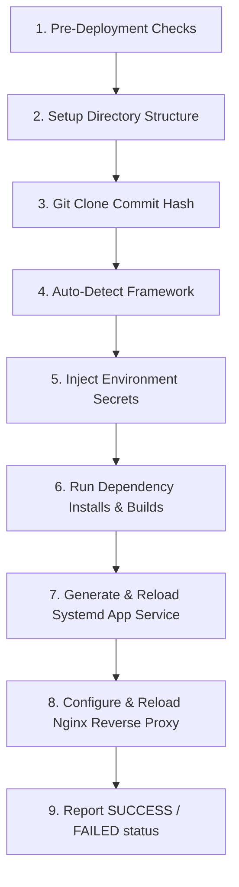

# Go Agent Daemon: Tasks & Execution Internals

This document details the internal operations, command execution workflows, and server directories structure managed by the **SerDaddy Go Agent**.

---

## ⚙️ Daemon Management (Systemd Integration)

In production, the Go Agent runs as a persistent background daemon managed by systemd on the target VPS.

*   **Service Configuration File**: `/etc/systemd/system/serdaddy-agent.service`
*   **Startup Commands**:
    ```bash
    sudo systemctl daemon-reload
    sudo systemctl enable serdaddy-agent
    sudo systemctl start serdaddy-agent
    ```
*   **Daemon Privileges**: The agent runs under a dedicated `serdaddy` system user. It is granted granular sudo access (via `/etc/sudoers.d/serdaddy`) specifically to run `nginx -t`, `systemctl reload nginx`, and `systemctl restart serdaddy-project-*` commands without password prompts.

---

## 📂 VPS Project Directory Layout

To support zero-downtime rollbacks, the agent maintains a **Releases folder structure** for each hosted project under `/var/www/projects/`:

```bash
/var/www/projects/
└── my-next-app/
    ├── current/              # Symbolic link pointing to the active release folder
    │                         # e.g., symlink -> /var/www/projects/my-next-app/releases/a7b1c3d
    ├── .env.production       # Master environment variables backup
    └── releases/
        ├── a7b1c3d/          # Release folder named after Git Commit Hash
        │   ├── node_modules/
        │   ├── package.json
        │   └── .env -> /var/www/projects/my-next-app/.env.production (symlink)
        └── f9a2e3b/          # Older successful build folder
```

---

## 🔄 Step-by-Step Deployment Engine Workflows

When the Go Agent receives a `deploy:start` WebSocket event, it executes the following **9 sequential operations**:



### 1. Pre-Deployment Validation
Before cloning code, the Agent verifies server sanity to prevent half-broken states:
*   **Nginx Verification**: Verifies `nginx` service status.
*   **Port Collision Checks**: Checks if the allocated project port is currently bound by another process.
*   **Resource Threshold checks**: Inspects if disk space is below `5%` capacity.

### 2. Setup Directory Structure
*   Creates `/var/www/projects/<project-name>/releases/<commit-hash>` folder.
*   Writes the master environment variable file `/var/www/projects/<project-name>/.env.production` containing encrypted configurations passed from the Hub.

### 3. Code Retrieval (Git Clone)
*   Clones the repository branch and checks out the specific commit:
    ```bash
    git clone --depth=1 --branch=<branch> <repo-url> /var/www/projects/<project-name>/releases/<commit-hash>
    ```

### 4. Automatic Framework Identification
The Agent scans files in the root folder of the newly cloned release to identify build actions:
*   `package.json` $\rightarrow$ **Node.js**. Scans dependencies for:
    *   `next` $\rightarrow$ Next.js framework. (Build: `npm run build`, Start: `next start -p <port>`)
    *   `nuxt` $\rightarrow$ Nuxt.js framework.
    *   Otherwise $\rightarrow$ Generic Node/Express backend. (Start: `node <main-file>`)
*   `requirements.txt` / `Pipfile` $\rightarrow$ **Python Web App**. (Builds virtualenv, Start: `gunicorn -b 0.0.0.0:<port> main:app`)
*   `index.html` (no package configurations) $\rightarrow$ **Static Webapp**. (No runtime process, served directly by Nginx).

### 5. Environment Variables Injection
*   Injects variables by creating a symlink `.env` inside the specific commit release folder pointing back to the master `/var/www/projects/<project-name>/.env.production` file.

### 6. Dependency Installation & Compilation
*   Spawns shell compiler processes (e.g. `npm ci` and `npm run build` for Node).
*   **Real-time Log Piping**: Captures stdout and stderr streams. It broadcasts logs back to your dashboard browser console byte-by-byte using the `deploy:log` websocket event.

### 7. Process Lifecycle Management (Systemd App Units)
If the project is a dynamic web application, the Agent writes a systemd service file:
*   **Path**: `/etc/systemd/system/serdaddy-project-<project-name>.service`
*   **Unit Configuration**:
    ```ini
    [Unit]
    Description=SerDaddy Application - %i
    After=network.target

    [Service]
    Type=simple
    User=serdaddy
    WorkingDirectory=/var/www/projects/<project-name>/current
    ExecStart=/usr/bin/node dist/main.js
    Restart=always
    Environment=PORT=<assigned-port>

    [Install]
    WantedBy=multi-user.target
    ```
*   **Execution**: The agent runs `systemctl daemon-reload`, enables the unit, swaps the `/current/` symlink to point to the new `/releases/<commit-hash>` folder, and runs `systemctl restart serdaddy-project-<project-name>`.

### 8. Nginx Router Mapping & Reload
*   Writes Nginx block configuration to reverse proxy domain traffic to the local port:
    *   **Path**: `/etc/nginx/sites-available/serdaddy-project-<project-name>`
    *   **Configuration template**:
        ```nginx
        server {
            listen 80;
            server_name <domain-name>;

            location / {
                proxy_pass http://127.0.0.1:<assigned-port>;
                proxy_http_version 1.1;
                proxy_set_header Upgrade $http_upgrade;
                proxy_set_header Connection 'upgrade';
                proxy_set_header Host $host;
                proxy_cache_bypass $http_upgrade;
            }
        }
        ```
*   Symlinks Nginx configuration to `/etc/nginx/sites-enabled/`.
*   Executes `sudo nginx -t` (config test). If successful, executes `sudo systemctl reload nginx`.

### 9. Rollback Execution Flow
When the Hub issues a `deploy:rollback` command:
1.  The Go Agent receives the target rollback commit hash.
2.  Verifies if the directory `/var/www/projects/<project-name>/releases/<rollback-hash>` exists.
3.  Swaps the `/current` symlink target pointer directly to that older release folder.
4.  Restarts the systemd application service: `sudo systemctl restart serdaddy-project-<project-name>`.
5.  *(Zero Downtime)*: The switch takes under **50ms**, ensuring users experience no downtime during rollbacks.
