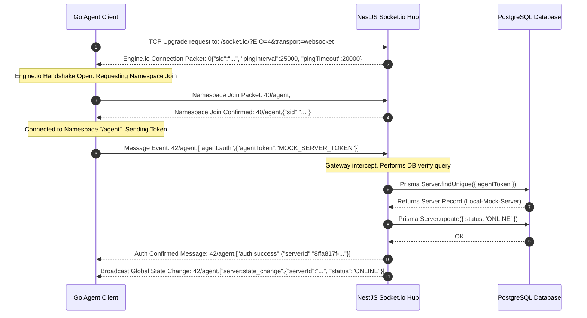

# SerDaddy: Handshake & Real-Time Telemetry Flow Guide

This document explains the current state of **SerDaddy**, detailing how the monorepo components map together, how the Engine.io/Socket.io protocol handshake operates over raw WebSockets, and how live telemetry metrics are streamed.

---

## 🏛️ Monorepo Components & Port Mapping

Your development environment maps together three isolated subsystems running concurrently on your local machine:

```
+------------------------------------+
|         Browser Interface          |
|      Next.js Panel (Port 3000)     |
+------------------------------------+
                  |
     (Web HTTP / Socket.io Sub)
                  |
                  v
+------------------------------------+
|          Control Backend           |
|      NestJS + Fastify (Port 4000)  |  <--- (Prisma client reads/writes) --->  [ PostgreSQL (Port 5432) ]
+------------------------------------+
                  ^
                  |
        (WebSocket Client / TLS)
                  |
+------------------------------------+
|           Target Server            |
|       Go Agent Daemon Process      |
+------------------------------------+
```

---

## 🔌 The WebSocket Handshake Protocol

Because the NestJS server is powered by **Socket.io v4** (using the `IoAdapter`), we use the **Engine.io v4 (EIO=4)** transport frame standard over raw TCP WebSockets. 

Here is the exact step-by-step breakdown of how the Go Agent connects and authenticates:



### Protocol Frame Structure Explanations:
*   `0`: Engine.io **Open** packet. Dispatched by NestJS to signify a successful websocket protocol upgrade. Contains keep-alive parameters (ping rates).
*   `40/agent,`: Engine.io **Message** packet (`4`) containing a Socket.io **Connect** code (`0`) for the namespace `/agent`. The trailing comma `,` serves as the delimiter.
*   `42/agent,["agent:auth", { ... }]`: Engine.io **Message** packet (`4`) containing a Socket.io **Event** code (`2`) directed to the `/agent` namespace. This sends the `agentToken` payload inside a JSON array: `[eventName, eventData]`.
*   `2`: Engine.io **Ping** packet. Sent automatically by the server based on the `pingInterval`.
*   `3`: Engine.io **Pong** packet. Must be returned immediately by the Go Agent to keep the connection alive. If the agent does not send a `3` packet within the `pingTimeout` window, NestJS terminates the socket.

---

## 📊 Live Telemetry Streaming Loop

Once authenticated, the Go Agent launches a background monitoring loop that feeds the panel dashboard gauges:

```mermaid
sequenceDiagram
    autonumber
    participant Agent as Go Agent Daemon
    participant Hub as NestJS Fastify API
    participant Browser as Next.js Dashboard UI

    loop Every 10 Seconds
        alt is Mock Mode
            Agent->>Agent: Generate random telemetry values (CPU 5-35%, RAM, Disk)
        else is Real Hardware Mode
            Agent->>Agent: Query Host OS statistics (/proc, gopsutil)
        end

        Agent->>Hub: Emits Event: 42/agent,["metrics:push",{"cpuPercent": 24.3, "ramUsedBytes": ...}]
        Note over Hub: Gateway catches message & identifies server ID via client Socket ID
        Hub-->>Browser: Broadcasts stats payload: metrics:server:SERVER_ID
        Note over Browser: React state updates; Recharts charts redraw gauges in real-time
    end
```

### Metrics Data Packet Structure:
```json
{
  "cpuPercent": 28.50,
  "ramUsedBytes": 1022000000,
  "ramTotalBytes": 2048000000,
  "diskUsedBytes": 12880000000,
  "diskTotalBytes": 42900000000,
  "uptimeSeconds": 86400
}
```
This payload is pushed directly to the dashboard client without database writes, keeping server I/O overhead at absolute zero.
