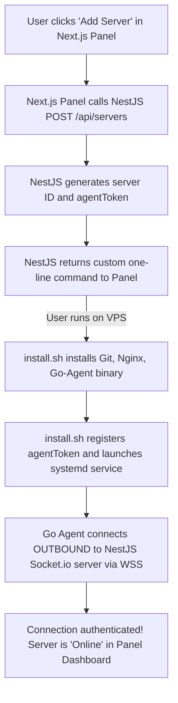

# SerDaddy: Project Flow & Folder Structure (NestJS + Fastify)

This document outlines the complete directory layout for the **SerDaddy** monorepo using **pnpm workspaces** and details the core operational workflows between the Next.js Frontend, the NestJS Hub API, and the Go Agent.

---

## 📂 Monorepo Folder Structure

We organize the panel (Next.js), the API backend (NestJS), and the agent (Go) inside a single unified repository managed by `pnpm`:

```bash
SerDaddy/
├── pnpm-workspace.yaml     # pnpm workspace configuration file
│
├── panel/                  # Next.js Frontend Dashboard (UI Only)
│   ├── app/                # Next.js App Router (React, Tailwind)
│   │   ├── layout.tsx      # Root styling and font definitions
│   │   ├── page.tsx        # Login / Landing page
│   │   └── dashboard/      # Protected Dashboard Views
│   │       ├── page.tsx    # Dashboard landing (Server listings & metrics summaries)
│   │       └── servers/    # Server inspect modules (Gauge charts & logs shell)
│   ├── components/         # Reusable Tailwind UI components (Shadcn/ui)
│   │   ├── ui/             # Radix primitives (Button, Card, Input)
│   │   ├── log-viewer.tsx  # Real-time build log xterm.js terminal
│   │   └── metrics-chart.tsx # Live metrics charts using Recharts
│   ├── package.json
│   ├── postcss.config.js
│   └── tailwind.config.js
│
├── hub-api/                # NestJS Backend API Server (Fastify HTTP + Socket.io)
│   ├── src/
│   │   ├── main.ts         # NestJS entry point (using FastifyAdapter)
│   │   ├── app.module.ts   # App module containing configurations
│   │   ├── prisma/         # Global Prisma Database integration service
│   │   │   ├── prisma.module.ts
│   │   │   └── prisma.service.ts
│   │   ├── socket/         # WebSocket Gateways (Agent & Client communication)
│   │   │   └── agent.gateway.ts
│   │   ├── deployments/    # BullMQ tasks processor and webhooks module
│   │   │   ├── deployments.processor.ts
│   │   │   └── webhooks.controller.ts
│   │   ├── servers/        # Server registration & registry routes
│   │   └── projects/       # Projects configuration modules
│   ├── prisma/
│   │   ├── schema.prisma   # PostgreSQL database relational models
│   │   └── .env            # Local Postgres connection settings
│   ├── package.json
│   └── tsconfig.json
│
├── agent/                  # Server Daemon (Go executable)
│   ├── go.mod              # Go packages descriptor
│   ├── main.go             # Agent startup (handshake validator, mock CLI flag)
│   ├── connection/
│   │   └── client.go       # Persistent WebSocket connector
│   ├── runner/
│   │   ├── executor.go     # Git clone, framework scanner, and script builders
│   │   └── nginx.go        # Nginx virtual block template creator & symlink switcher
│   └── monitor/
│       └── telemetry.go    # Telemetry metrics worker (cpu/ram/disk checker)
│
└── scripts/
    └── install.sh          # Server registration script (install command)
```

---

## 🔄 Core Project Flows

### 1. Agent Provisioning Flow
How a new target VPS server gets connected to the NestJS API Hub:



---

### 2. The Deployment Pipeline Flow
What happens when you click "Deploy Now" or push code to GitHub:

```mermaid
sequenceDiagram
    autonumber
    participant Developer as Developer / Git Push
    participant Panel as Next.js Panel (UI)
    participant Hub as NestJS Hub (Fastify API)
    participant Redis as BullMQ (Queue)
    participant Agent as Go Agent Daemon (VPS)
    
    Developer->>Panel: Trigger Deploy (Click / Webhook)
    Panel->>Hub: POST /api/projects/:id/deploy
    Hub->>Redis: Enqueue deployment job (ProjectId, CommitHash)
    Redis-->>Hub: Job picked up by NestJS processor
    Hub->>Agent: WebSocket Event: deploy:start { config details }
    Agent->>Agent: Set state to 'DEPLOYING'
    
    rect rgb(240, 240, 240)
        Note over Agent: Phase 1: Pre-validation
        Agent->>Agent: Validate ports, check disk space, test Nginx
    end

    rect rgb(230, 245, 230)
        Note over Agent: Phase 2: Code Retrieval
        Agent->>Agent: git clone to /var/www/releases/COMMIT_HASH
    end

    rect rgb(230, 240, 245)
        Note over Agent: Phase 3: Framework Detection & Build
        Agent->>Agent: Identify framework -> install dependencies -> run build scripts
        Agent-->>Hub: Stream build logs over WebSocket (deploy:log)
        Hub-->>Panel: Broadcast logs to Browser dashboard shell
    end

    rect rgb(245, 240, 230)
        Note over Agent: Phase 4: Server Configuration
        Agent->>Agent: Write environment variables to .env
        Agent->>Agent: Write Nginx reverse proxy block & symlink
        Agent->>Agent: Restart systemd app service & reload Nginx
    end
    
    Agent->>Hub: WebSocket Event: deploy:status { SUCCESS }
    Hub->>Panel: Update UI dashboard state (Deployment Complete)
    Panel->>Developer: Update developer
```



---

### 3. Monitoring Telemetry Flow
How real-time resource usage charts stay updated:

```mermaid
loop Every 10 seconds
    Agent->>Agent: Gather CPU, RAM, Disk, Uptime stats (gopsutil)
    Agent->>Hub: Send stats payload over WebSocket (metrics:push)
    Hub->>Panel: Stream live metrics directly to UI dashboard charts (Socket.io)
end
```
